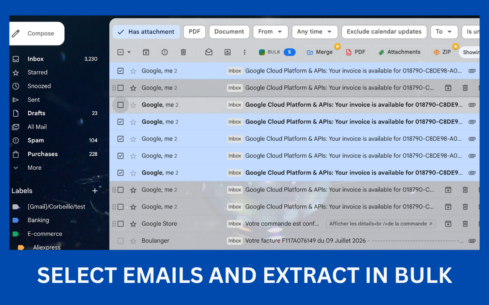
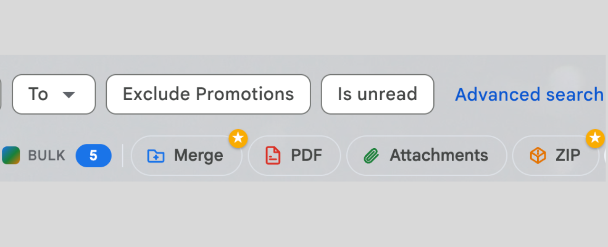
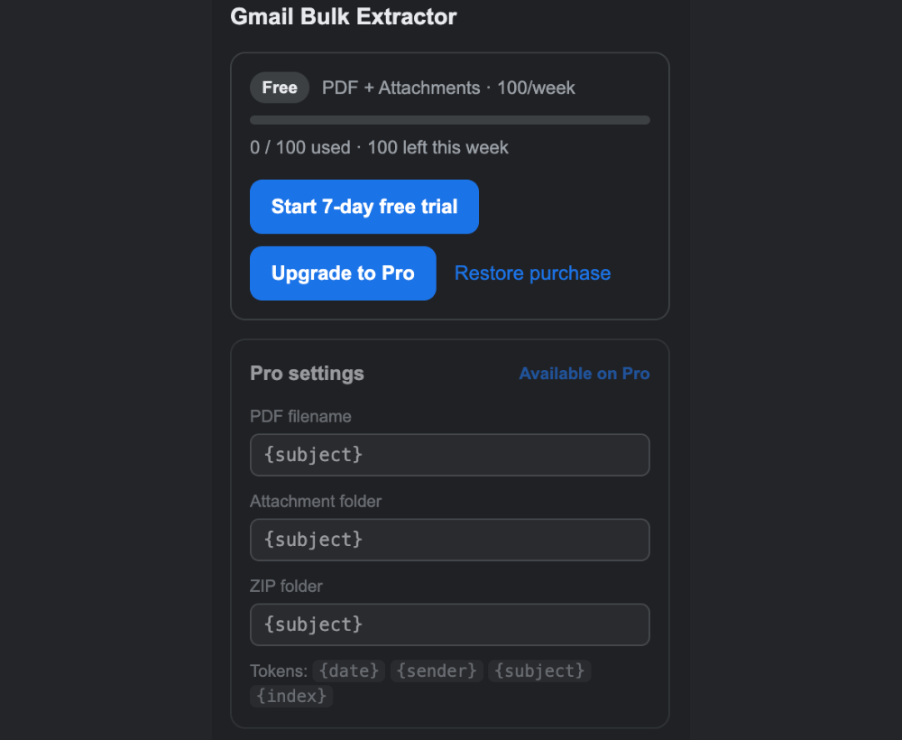
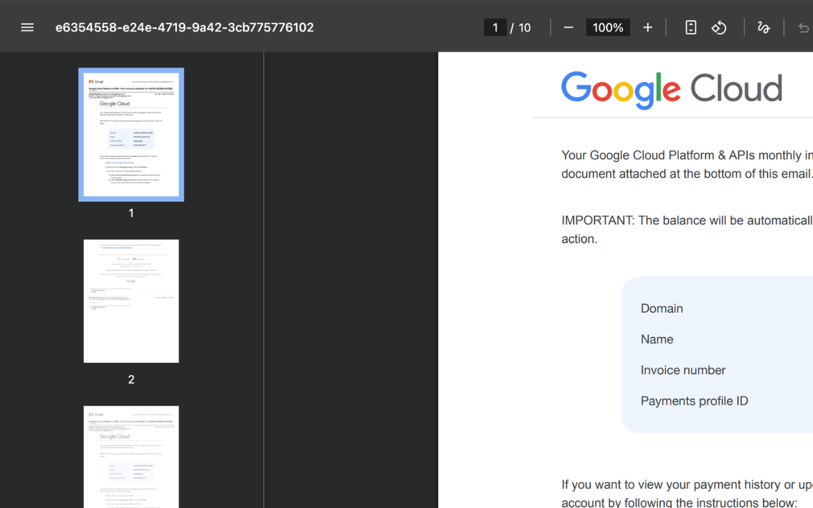

<p align="center">
  
</p>

<h1 align="center">Gmail Bulk Extractor</h1>

<p align="center">
  <b>Select many Gmail emails. Save them all as PDFs, grab every attachment,<br>
  export a ZIP, or merge the lot into one document.</b>
</p>

<p align="center">
  No OAuth · no server · nothing ever leaves your browser
</p>

<p align="center">
  <a href="https://chromewebstore.google.com/detail/gmail-bulk-extractor/kiplmkbhobmlolkeodgophegcdphiolp" target="_blank" rel="noopener">
    
  </a>
</p>

<p align="center">
  <a href="https://chromewebstore.google.com/detail/gmail-bulk-extractor/kiplmkbhobmlolkeodgophegcdphiolp" target="_blank" rel="noopener"></a>
  
  
  
</p>

<!--
  Users and rating badges: shields.io returns "not found" for both until the
  listing has actual installs and reviews. Move them into the row above once
  the store page shows them.

  <a href="https://chromewebstore.google.com/detail/gmail-bulk-extractor/kiplmkbhobmlolkeodgophegcdphiolp" target="_blank" rel="noopener"></a>
  <a href="https://chromewebstore.google.com/detail/gmail-bulk-extractor/kiplmkbhobmlolkeodgophegcdphiolp" target="_blank" rel="noopener"></a>
-->

<p align="center">
  <a href="https://cyber-fenix.github.io/products/gmail-bulk-extractor/">Website</a> ·
  <a href="https://cyber-fenix.github.io/support/">Support</a> ·
  <a href="https://cyber-fenix.github.io/privacy/">Privacy</a>
</p>

---

## What it does

Gmail is excellent at showing you one message and hopeless the moment you need
fifty of them saved, filed, or handed to someone else. This extension adds one
toolbar to Gmail that acts on **every message you've selected**.

<p align="center">
  
</p>

| Action | What you get |
|---|---|
| **PDF** | One PDF per selected email, laid out like Gmail's own print view |
| **Attachments** | Every attachment from every selected email, in a folder per message |
| **ZIP** ⭐ | Emails + attachments as a single archive, one folder per email plus a browsable `index.html` |
| **Merge** ⭐ | The whole selection rendered into **one** PDF, opened in a new tab to read, print or save |

⭐ = Pro. Works with Gmail and Google Workspace accounts, including multiple
signed-in accounts.

## Free vs Pro

Every new install gets a **7-day Pro trial** — all features, no limits. After it
ends the extension keeps working on the Free tier; nothing you already exported
is affected.

| | Free | Pro & trial |
|---|---|---|
| PDF, Attachments | ✅ | ✅ |
| Emails per week | up to **100** | **unlimited** |
| ZIP export | — | ✅ |
| Merge into one PDF | — | ✅ |
| File / folder naming | defaults | **custom templates** |

Pro is a subscription **or** a one-time unlock, handled by
[ExtensionPay](https://extensionpay.com) with Stripe underneath. The weekly
count covers emails processed by the free actions and resets on a rolling 7-day
window.

<p align="center">
  
</p>

On Pro, file and folder names follow your own templates — `{date}`, `{sender}`,
`{subject}`, `{index}` — set from the popup.

## How it works — no Gmail API, no OAuth

The extension reads mail through your **existing Gmail session** rather than the
Gmail REST API:

- Email content comes from Gmail's built-in print view (`view=pt`), fetched
  same-origin with your session cookies.
- Attachment bytes come from Gmail's own attachment URLs.
- PDFs are rendered locally through the Chrome DevTools Protocol
  (`Page.printToPDF`), which is why the `debugger` permission is requested.

**Your email content never leaves your device.** All extraction, PDF rendering
and archiving happen locally. The only network calls the extension makes are to
extensionpay.com / Stripe, and only to check or complete a Pro licence — no
email data is part of those requests. Because it uses no restricted Gmail OAuth
scopes, there is **no Google Cloud project or consent screen** to set up.

> While a PDF is generated, Chrome shows a *"Gmail Bulk Extractor started
> debugging this browser"* banner on a background tab. That is the `debugger`
> permission performing `Page.printToPDF`; it clears when the operation finishes.

<p align="center">
  
</p>

## Where files are saved

- **Attachments** → `Downloads/gmail-extract-<date>/<email subject>/…`
- **PDFs** → `Downloads/gmail-pdf-<date>/<email subject>.pdf`
- **ZIP** → `Downloads/gmail-export-<date>.zip`

On Pro the `<email subject>` segments follow your naming templates. **Merge**
doesn't save a file — it opens the combined PDF in a new tab, so you decide
whether to print or save it.

## Permissions

| Permission | Why |
|------------|-----|
| `debugger` | `Page.printToPDF` for the PDF and Merge actions |
| `downloads` | saving attachments, PDFs, and the ZIP |
| `scripting`, `tabs`, `activeTab` | injecting the toolbar and rendering the print view |
| `storage` | plan/usage counter and Pro settings |
| host: `mail.google.com` | reading the logged-in Gmail session |
| host: `extensionpay.com` | Pro licence check + checkout (no email data) |

## Development

```bash
npm install
npm run build      # tsc --noEmit && vite build  → dist/
npm run dev        # rebuilds on change
```

1. Open `chrome://extensions`
2. Enable **Developer mode**
3. **Load unpacked** → select `dist/`

Then open Gmail, select some emails, and use the toolbar.

> After loading a new build, reload the Gmail tab too so the updated content
> script takes effect.

<details>
<summary><b>Project layout</b></summary>

```
src/
  manifest.config.ts     MV3 manifest (typed)
  background/index.ts     service worker: attachment/PDF downloads, Merge render, licensing
  content/
    index.ts              toolbar injection, selection, action dispatch
    toolbar.ts            toolbar UI (theme-aware, Gmail-native styling)
    gmail-dom.ts          all Gmail selectors + toolbar anchors (isolated)
    extract.ts            fetch print-view HTML + parse attachment refs
    zip.ts                JSZip assembly + attachment fetch
    toast.ts              in-page progress/error + upsell toasts
    extpay.ts             ExtensionPay handshake (runs only on extensionpay.com)
  mainworld/ik.ts         reads window.GLOBALS (ik) and bridges it via <html> attr
  lib/
    session.ts            account index / ik / session URL builders
    pdf.ts                chrome.debugger printToPDF engine
    download.ts           filename sanitizing + date stamp
    license.ts            ExtensionPay wrapper + license message helpers
    usage.ts              free-tier weekly email counter (chrome.storage)
    entitlements.ts       the single gate: may this action run?
    settings.ts           Pro settings persistence
    naming.ts             filename/folder template engine (Pro)
  popup/                  plan/usage dashboard + Pro settings
```

The freemium gate lives at **one point** — `handleAction` in `content/index.ts`,
after the selection is read. Pro status is validated server-side by
ExtensionPay; the weekly free cap is metered locally (a soft cap by design).

Gmail's internal markup is undocumented and can change; when it does, the fix is
almost always confined to `content/gmail-dom.ts` and `lib/session.ts`. Run
`window.__gbeDiag()` in the Gmail page console to inspect selector matches.

</details>

## Found a bug?

[Open an issue](https://github.com/cyber-fenix/gmail-bulk-extractor/issues) — please
include your browser, what you selected, which button you pressed, and what
happened instead.

If the extension saves you time, a
**[★★★★★ review on the Chrome Web Store](https://chromewebstore.google.com/detail/gmail-bulk-extractor/kiplmkbhobmlolkeodgophegcdphiolp/reviews)**
helps more than anything else.

## License

MIT — see [LICENSE](./LICENSE). Built by [CyberFenix](https://cyber-fenix.github.io/).
